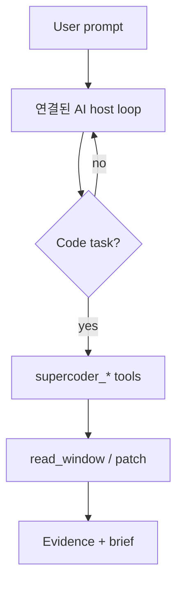

# Architecture

## 개요

Supercoder는 host agent **위에** 얹는 코딩 전용 하네스입니다. host core를 대체하지 않습니다.



## 패키지 구조

```
src/cluxion_agentplugin_supercoder/
  plugin.py, runner.py
  core/ — cursor, hash_patch, repo_map, syntax_gate, lint_gate, line_budget, safety, queue
  rust_bridge.py
rust/supercoder_index/
```

## Host vs Supercoder

| Host (연결된 AI) | Supercoder |
|------------------|------------|
| LLM, OAuth, provider | 코딩 plan, bounded context |
| terminal/file tools | patch 검증, safety gate |
| 대화·응답 | WorkUnit·evidence 요구 |

## WorkUnit queue

코딩 작업은 **결정론적으로** 분해됩니다: `map` → `edit` → `verify` → `brief`.

**연결된 AI**가 각 단계에 맞는 `supercoder_*` 도구를 호출합니다.

## Rust layer

- `supercoder-index hash` / `scan`
- 없으면 Python `hash_patch.file_hash` fallback

## Preprocessing과의 관계

| 플러그인 | 역할 |
|----------|------|
| preprocessing | 전처리, 정직함, 명확화, 일반 segment 큐 |
| supercoder | 코딩 cursor, patch, line budget |

같은 세션에서 병행 사용 가능합니다.